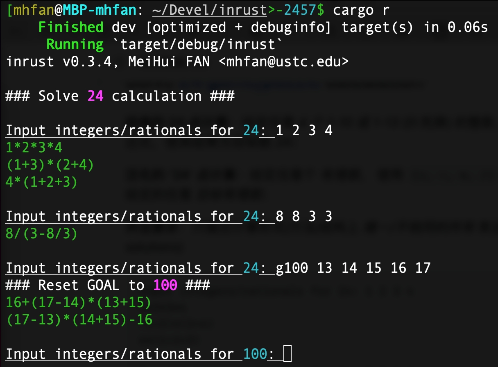

# Study Yew/Rust for Frontend GUI

在 [这个 Rust 学习项目](https://github.com/mhfan/inrust) 中分别用
[Rust](https://github.com/mhfan/inrust/blob/master/src/calc24.rs) 和
[C++](https://github.com/mhfan/inrust/blob/master/src/calc24.cpp) 实现了一系列泛化和通用
'24' 点计算问题的简洁算法，还做了一个基于命令行的简单交互程序；

为了能让一个小学三四、八九岁年级的小朋友 (我可爱的小儿子) 更有兴趣、更简单地玩，
最好能为基于扑克牌数的 24 点计算实现一套足够简洁的只用鼠标点击就能完的图形用户界面；
另外，最后还要能支持自己输入任意有理数和目标数、更改数字个数等等；
而公开领域能找到的一些 24 点游戏网页/App 在功能和体验上都不太满足我的设想，关键是还没法跑我骄傲的算法实现；

简单研究了 [Slint](https://github.com/slint-ui/slint) 和 [egui](https://github.com/emilk/egui)
之后发现， Rust 世界并没有一个足够好用能够实现我希望的简洁交互的 GUI 框架，好在 Rust 在 Wasm 世界足够灵活和优秀
(Rust 本来就是从 Mozilla 开始的)，而 [Html5 + CSS3](https://www.w3schools.com/html/)
有足够强大的表现能力，应该足以描述任何 GUI 交互形式，于是决定尝试 Rust + Wasm + [Yew](https://yew.rs/)；

所以有了本项目利用 GitHub Pages 技术部署在 [Github.io](https://pages.github.com/) 上，
并且集成了 [Tauri](https://github.com/tauri-apps/tauri) 可以编译成本地跨端应用程序；
这套技术足以满足各种快速原型的开发需求。

Based on [Yew Template](https://github.com/Ja-sonYun/yew-template-for-github-io) for
[Github.io](https://pages.github.com/), with [tailwind.css](https://tailwindcss.com/) and
[trunk](https://trunkrs.dev) for build.

## TODO

+ [ ] 增加一些 CSS 动效；
+ [ ] 用 SVG 矢量资源模拟扑克牌发牌；
+ [x] 用 Tauri 打包桌面应用和移动应用；
+ [ ] implement a backend/server with Rust;
